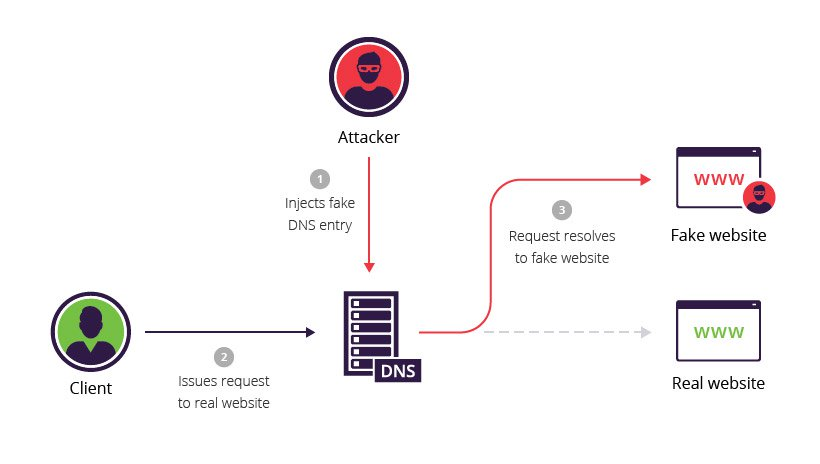

# 📡 Live Network Traffic Visualizer & DNS Spoofing Demo

A real-time network traffic analyzer with an integrated **DNS spoofing demonstration** built with Python, Streamlit, and Scapy. Designed for **cybersecurity education** to help students visualize live network activity and understand how DNS-based attacks work in a controlled lab environment.



> ⚠️ **Educational Use Only** — The DNS spoofing feature must only be used on networks you own or have explicit permission to test on. Misuse may violate laws in your jurisdiction.

---

## ✨ Features

### 📊 Live Dashboard
- **Real-time packet capture** using Scapy
- **Protocol distribution** (TCP, UDP, ICMP, ARP, etc.)
- **Top source & destination IPs** with traffic volume
- **Service/port analysis** (HTTP, HTTPS, DNS, SSH, etc.)
- **Domain tracking** via DNS queries and TLS SNI
- **Live packet feed** with timestamps
- **Session metrics**: PPS, data captured, duration
- **CSV export** of captured packets
- **Pause/resume** and **clear** controls

### 🎭 DNS Spoofing Demo
- Intercept DNS queries for a target domain
- Forge DNS responses pointing victims to a fake IP
- Built-in **fake HTTP server** (serves custom HTML)
- Built-in **fake HTTPS server** with auto-generated self-signed certs
- **Hosts file injection** to guarantee local redirection (bypasses DNS race conditions)
- Live log of intercepted queries
- Customizable fake landing page (default: fake UPI payment page)
- Built-in troubleshooting guide (DoH, DNS cache, etc.)

---

## 🛠️ Installation

### Prerequisites
- **Python 3.9+**
- **Npcap** (Windows) or **libpcap** (Linux/macOS) — required by Scapy for packet capture
  - Windows: Download from [npcap.com](https://npcap.com/)
- **Administrator / root privileges** (required for raw packet capture and hosts file editing)

### Setup

```bash
# Clone the repository
git clone https://github.com/yourusername/live-netviz.git
cd live-netviz

# Create a virtual environment (recommended)
python -m venv venv
# Windows
venv\Scripts\activate
# Linux/macOS
source venv/bin/activate

# Install dependencies
pip install -r requirements.txt
```

### `requirements.txt`
```
streamlit
pandas
plotly
scapy
cryptography
```

---

## 🚀 Usage

### Run the App

**Windows (run as Administrator):**
```bash
streamlit run app.py
```

**Linux/macOS:**
```bash
sudo streamlit run app.py
```

Open your browser to `http://localhost:8501`.

### Live Dashboard
1. Select your network interface (e.g., `Wi-Fi`, `Ethernet`) from the sidebar
2. Traffic visualization begins immediately
3. Adjust refresh rate and chart size from the sidebar
4. Use **Pause**, **Clear**, and **Export CSV** as needed

### DNS Spoofing Demo
1. Go to the **🎭 DNS Spoof Demo** tab
2. Enter a target domain (e.g., `www.example.com`)
3. Set the redirect IP (usually `127.0.0.1` for local testing)
4. Customize the fake page HTML if desired
5. Click **▶ Start Spoofing**
6. *(Optional but recommended)* Click **💉 Inject into Hosts File** for guaranteed local redirection
7. Follow the troubleshooting steps (disable DoH, flush DNS caches)
8. Visit `http://<target-domain>` in your browser to see the fake page

---

## ⚠️ Important: DNS over HTTPS (DoH)

Modern browsers bypass traditional DNS queries by using **encrypted DoH**. You **must** disable DoH for the spoofing demo to work:

- **Chrome/Edge:** `Settings → Privacy and Security → Security → Use secure DNS → OFF`
- **Firefox:** `Settings → General → Network Settings → Enable DNS over HTTPS → OFF`

Then clear DNS caches:
```bash
ipconfig /flushdns               # Windows
sudo dscacheutil -flushcache     # macOS
sudo systemd-resolve --flush-caches  # Linux (systemd)
```

And clear your browser's internal DNS cache:
- Chrome/Edge: `chrome://net-internals/#dns` → Clear host cache
- Firefox: `about:networking#dns` → Clear DNS Cache

---

## 📂 Project Structure

```
live-netviz/
├── app.py              # Main Streamlit application
├── requirements.txt    # Python dependencies
├── screenshot.png      # App screenshot
└── README.md
```

---

## 🔒 Security & Ethics

This tool is intended for:
- ✅ Cybersecurity classrooms and workshops
- ✅ Personal lab environments
- ✅ Understanding how DNS-based attacks work defensively
- ✅ Network traffic analysis on your own devices

**Do NOT use this tool for:**
- ❌ Attacking networks you don't own
- ❌ Intercepting others' traffic without consent
- ❌ Any illegal or malicious activity

The author accepts **no responsibility** for misuse of this software.

---

## 🧪 Tested Environment

- Windows 11 with Npcap
- Python 3.11
- Streamlit 1.30+
- Scapy 2.5+

---

## 🐛 Troubleshooting

| Issue | Solution |
|-------|----------|
| `Permission denied` on hosts file | Run terminal as Administrator/root |
| No packets captured | Verify interface, install Npcap, run as admin |
| DNS Seen = 0 | Wrong interface selected, or DoH is enabled |
| DNS Seen > 0, Spoofed = 0 | Domain mismatch — check spelling |
| Browser shows real site | DNS cache — flush OS + browser caches |
| HTTPS cert warning | Expected with self-signed certs — click *Advanced → Proceed* |

---

## 📜 License

MIT License — free to use for educational purposes.

---

## 🙏 Acknowledgments

- [Scapy](https://scapy.net/) — packet manipulation library
- [Streamlit](https://streamlit.io/) — interactive UI framework
- [Plotly](https://plotly.com/python/) — live charts
- [cryptography](https://cryptography.io/) — self-signed cert generation

---

## 👤 Author

Built for cybersecurity education at **Kovai Labs**.

Pull requests and suggestions welcome!
